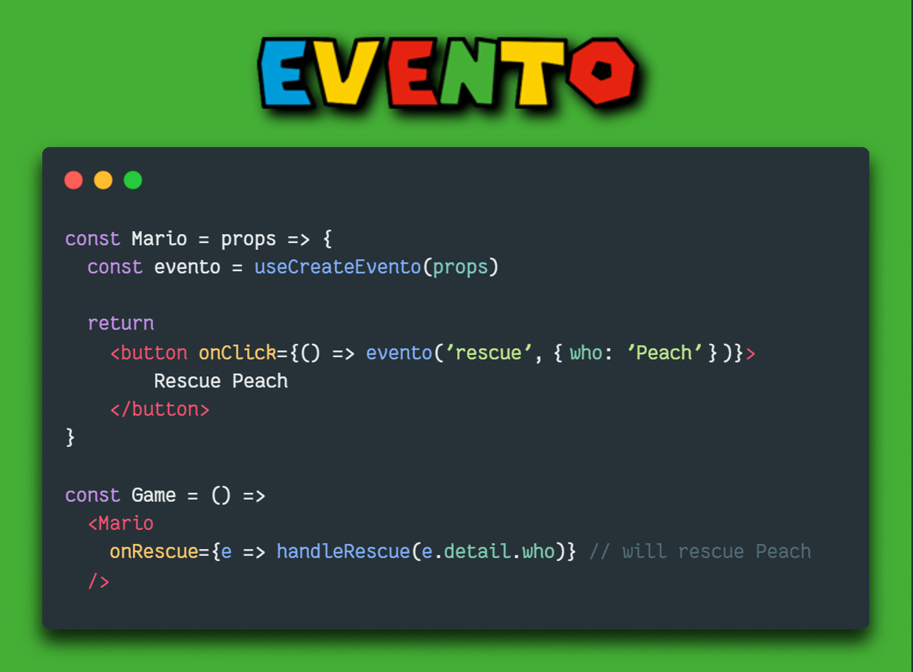

# component event for React
- Dispatch custom component event with a payload, or forward React synthetic event
- Replicate Svelte's `createEventDispatcher` and Vue's `$emit` behavior on React.
- Hook + HOC for class components.
- TypeScript support. 

[](https://www.npmjs.com/package/evento-react) [](https://madewithreactjs.com/p/evento/shield-link)



## Install

```bash
npm install --save evento-react
```

## A new event paradigm
Inspired by Svelte's [`createEventDispatcher()`](https://svelte.dev/tutorial/component-events) and Vue's [`$emit`](https://vuejs.org/guide/components/events.html), Evento brings component event to the world of React.

With Evento, a React component can dispatch a custom event with an optional payload, or forward a React event, to the component's consumer.
```js
const handleClick = () => evento('message', 'yo Mario World!')
```
The parent component will be able to listen to the event as it would listen to a React event: by using `on` + the capitalized name of the component event.
The data will be stored in `event.detail`.
```jsx
<Child onMessage={e => console.log(e.detail)}> // will log 'yo Mario World!'
```

The event dispatcher, named by convention `evento`(not to conflict with `useReducer`'s `dispatch`, or with `emit` from other libraries), can be either created by using one of the two provided hooks (`useCreateEvento` and `useExpCreateEvento`), or found in the props if you have wrapped your component with the `withEvento` HOC.

Evento comes with full TypeScript support, and will suggest all of the available event for a given component, based on the component's props type, as well as the payload type for the chosen event.

##  `evento`, the event dispatcher/emitter

The event dispatcher/emitter takes two parameters:
1. The event name, to be written in lower camel case (e.g. `myCoolEvent`). Evento will look for the `'on'` + upper camel case name in the props (`onMyCoolEvent`). If you are forwarding an event, you don't have to use the same name (although it's advised to do so, in order to avoid confusion).
2. The payload, which can be any type of data, which will be stored in `event.detail`, or a React synthetic event, which will be forwarded as it is to its parent.

## Main Hook

The standard way to create an event dispatcher is by using the `useCreateEvento` hook.
The hook takes the component props as the parameter and will observe changes in the props (so don't forget to watch for props changes if you wrap the event handler in `useCallback` ). 
It will return the event dispather/emitter, which can be used for multiple event.
```tsx
// child, hook consumer
const Mario = (props: Props) => {
  const evento = useCreateEvento<Props>(props)
  const handleClickA = () => evento("jump", "it's a me...")
  const handleClickB = () => evento("shoot", "Mariooo")

  return (
    <>
      <button onClick={handleClickA}>A</button>
      <button onClick={handleClickB}>B</button>
    </>
  )
}

// parent
const Level = () => 
  <>
    <Mario
      onJump={e => console.log(e.detail)} // will log "it's a me..."
      onShoot={e => console.log(e.detail)} // will log "Mariooo"
    />
  </>
```

## Experimental Hook

`useExpCreateEvento` hook is an experimental hook, similar to Svelte'e `createEventDispatcher`, as it doesn't take any arguments when called (in TypeScript though, you have to pass the Props type as Generic type); it will produce an event dispatcher like `useCreateEvento`. We suggest you use the standard hook for big projects, as we cannot grant that `useExpCreateEvento` will work with future React verisons.
Nonetheless, it may come in handy in some cases, for instance if you pass destructured props to your component. 
```tsx
export const Peach = ({ isBowserNear, shouldSaveMario }: PeachProps) => {
  const evento = useExpCreateEvento<PeachProps>()
  const handleClick = () => {
    if (isBowserNear && shouldSaveMario) {
      evento('saveMario', 'Yet again, I am saving Mario...')
    }
  return (
    <>
      <button onClick={handleClick}>Save</button>
    </>
  )
}
```

## HOC

You can wrap your compoenent in the HOC `withEvento`: it'll inject the event emitter in the props (`props.evento`) of the wrapped component.
In TypeScript, the props of the component need special typing: follow the guidelines in the appropriate paragraph, below.  
```tsx
type ShroomProps = {
  onEatMe: any,
}

const ShroomContainer = (props: HOCProps<ShroomProps>) => {
  const { evento } = props
  const handleClick = () => evento("eatMe", "I'll give you super-powers!")
  return (
    <div>
      <button onClick={handleClick}>A</button>
    </div>
  )
}

const Shroom = withEvento<ShroomProps>(ShroomContainer)
```

## `.then`: Promises and event-chaining

To parallel the DOM's `EventTarget.dispatchEvent` ([here](https://developer.mozilla.org/en-US/docs/Web/API/EventTarget/dispatchEvent)), Evento returns a Promise that resolve in `false` if no handler was run, or in `true` when the handler has returned (or, if the handler is asyncronous, the returned Promises has resolved).
```tsx
const Box = (props: BoxProps) => {
const evento = useCreateEvento(props)

return (
  <div className={`color-${props.color}`}>
    <button 
      onClick={
        () => evento('break', { shouldBreak: true })
          .then(res => res ? evento('releaseShroom') : null)
      }>
      ?
    </button>
  </div>
)
}
```

## event-forwarding

If you need to forward an event to the parent component, you can do it by passing said event to as second parameter to the event dispatcher. Evento will recognize and forward it as it is, instead of storing it in the detail of a custom event. As of now, you can forward only React synthetic event (and not HTML native events, nor custom event created with Evento).
You don't have to name the event as the synthetic event itself, although we advise you to keep the same name, to hint that the event that the handler is going to receive is not a custom one.
```tsx
// you can do this
onChange={e => evento('textChange', e)

// but it's better to do this
onChange={e => evento('change', e)}
```

## Typing with TypeScript

In order to benefit from TypeScript Intellisense and error checking, you have to declare the event handlers in the component props. For instance, if you dispatch a `'jump'` event, your props should look something like this : 
```tsx
type LuigiProps = {
  onJump: () => void,
  hasMustache: boolean,
}
```
With regards to the payload, if you are forwarding an event, you just have to type it as forwarded React event.
```tsx
type MarioProps = {
  onClick: (e: React.MouseEvent<HTMLButtonElement>) => void,
}
```
Otherwise, if you are creating a custom component event, so you will have to wrap the payload type into a `CustomEvent` type, as such : 
```tsx
type MarioProps = {
  onEat: (e: CustomEvent<string>) => void,
}
// the event will be dispatched as such
const handleClick = () => evento('eat', 'shroom')

```
When you are working with the experimental hook, you still have to pass the props type (but not the props themselves) to it :
```tsx
const evento = useExpCreateEvento<BowserProps>()
```
Finally, if you are working with the HOC, you should import `HOCProps` from the library, declare the props type and then type as such:

```tsx
type WarioProps = {
  isStrange: boolean,
  onStrangeMoustaches: (e: CustomEvent<string>) => void,
}

const WarioContainer = (props: HOCProps<WarioProps>) => { // will add evento dispatcher to the props type
  // your component's logic here
}

const Wario = withEvento<WarioProps>(WarioContainer)
```

## Example

[This CodeSanbox](https://codesandbox.io/s/evento-react-exemple-v39sbm) shows all the different uses you can make of the Evento library.


## Why component events?

There are three main advantages in using component events, instead of passing down the callback as a props and leaving it to the child to deal with it : 
1. **Reduced prop-drilling:** Although technically you are still passing the callbacks as props from the parent down to its child, the way you'll think the data flow will be from the child up, and not vice-versa. This will improve the developer experience.
2. **Independent & agnostic components:** Each component can focus on its own role, without having to adapt its internal functioning to the callback passed by their parent; also if the logic of the passed callback changes, this will not entail changing the code of the event dispatcher.
2. **Standardized event-listeners:** In JavaScript, and in most of JavaScript frameworks/libraries, the `on` suffix is associated to listening to events. 
With React it's difficult for the developer to know in advance what type of data the callback is expecting, or what data the child component is going to pass to the callback; with `evento` on the other hand, any event-listener will always receive an event (or nothing at all), as a parameter, making the codebase more homogeneous, and meeting the developer expectations of working with events when encountering a `on`-suffixed prop.

## Next 

Working on adding an event-dispatcher creator for class-based components.
Will keep you posted.
