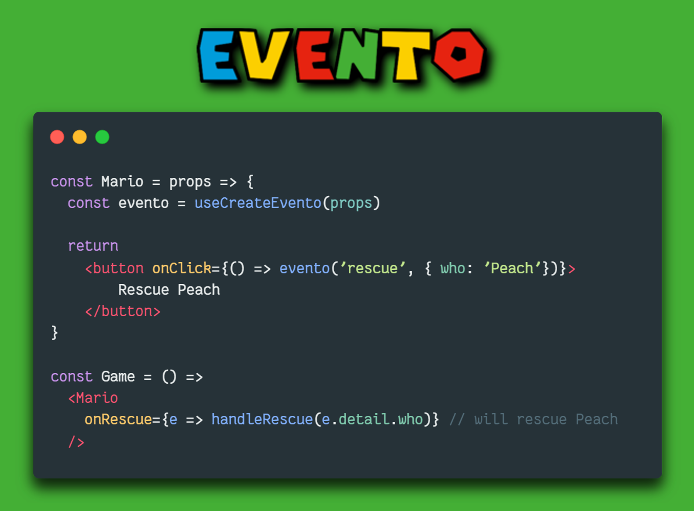

# Component Events for React
Hook to repoduce Svelte's `createEventDispatcher` behaviour on React (similar to Vue's `$emit`).

Hook + HOK, for class Components.

Typescript support. 

## A new Event paradigm
Inspired by Svelte's [`createEventDispatcher()`](https://svelte.dev/tutorial/component-events) and Vue's [`$emit`](https://vuejs.org/guide/components/events.html), Evento brings Component Events to the world of React.

With Evento, a React Component can dispatch a Custom Event, with an optional payload, to the Component's consumer.
```js
const handleClick = () => evento('message', 'yo Mario World!')
```
The parent Component will be able to listent to the Event as it would listen to a React event: by using `on` + the capitalized name of the Component Event.
The data will be stored in `event.detail`.
```jsx
<Child onMessage={e => console.log(e.detail)}> // will log 'yo Mario World!'
```

The Event dispatcher, named by convention `evento`(not to conflict with `useReducer`'s `dispatch`, or `emit` from other libraries), can be either created by using one of the two provided hooks (`useCreateEvento` and `useExpCreateEvento`), or accessed it in the props if you have wrapped your component with the `withEvento` HOC.

Evento comes with full TypeScript support, and will warn you in case you try to emit an event non-declared in the props type, or in case the payload doesn't correspond to the called event.

There are two main advantages in using Component Events, instead of passing down the callback as a props and leaving it to the child to deal with it : 
1. **Independent & Reusable Components :** Each Component can focus on its main role, without having to adapt its internal functioning to the callback passed by their parents; also if the code of the passed callback changes, this will not entail changing the code of the event dispatcher. Finally, the data emitted doesn't have to be formatted to the parent's need, as it is standardized as Event detail.
2. **Uniform Event-listeners :** In JavaScript, and in most of JavaScript frameworks/libraries, the `on` suffix is associated to listening to events. 
With React it's difficult for the developer to know in advance what type of data the callback is expecting, or what data the child Component is going to pass to the callback; With `evento`, any Event-listener is associated to an Event, making the codebase more homogeneous, and meeting the developer expectations of working with Events when encountering a `on` prop.

##  `evento`, the Event dispatcher/emitter

The Event dispatcher/emitter takes two parameters:
1. The Event name, to be written in lower camel case (e.g. `myCoolEvent`). Evento will look for the `'on'` + upper camel case name in the props (`onMyCoolEvent`).
2. The payload, which can be any type of data, which will be stored in `event.detail`.

## Main Hook
The standard way to create an Event dispatcher is by using the `useCreateEvento` hook.
The hook takes the Component props as parameter, and will observe changes in the props (so don't forget to watch for props changes if you wrap the event handler in `useCallback` ). 
It will return the Event dispather/emitter, which can be used for multiple Events.
```tsx
// Child, hook consumer
const Mario = (props: Props) => {
  const evento = useCreateEvento<Props>(props)
  const handleClickA = () => evento("jump", "it's a me...")
  const handleClickB = () => evento("shoot", "Mariooo")

  return (
    <>
      <button onClick={handleClickA}>A</button>
      <button onClick={handleClickB}>B</button>
    </>
  )
}

// Parent
const Level = () => 
  <>
    <Mario
      onJump={e => console.log(e.detail)} // will log "it's a me..."
      onShoot={e => console.log(e.detail)} // will log "Mariooo"
    />
  </>
```
## Experimental Hook
`useExpCreateEvento` hook is an experimental hook, similar to Svelte'e `createEventDispatcher`, as it doesn't take any arguments when called (in Typescript though, you have to pass the Props type as Generic type); it will produce an Event dispatcher like `useCreateEvento`. We suggest you use the standard hook for big projects, as we cannot grant that `useExpCreateEvento` will work with future React verisons.
Nonetheless, it may come in handy in some cases, for instance if you pass destructured props to your Component. 
```tsx
export const Peach = ({ isBowserNear, shouldSaveMario }: PeachProps) => {
  const evento = useExpCreateEvento<PeachProps>()
  const handleClick = () => {
    if (isBowserNear && shouldSaveMario) {
      evento('saveMario', 'Yet again, I am saving Mario...')
    }
  return (
    <>
      <button onClick={handleClick}>Save</button>
    </>
  )
}
```
## HOC
You can wrap your compoenent in the HOC `withEvento`: it'll inject the Event emitter in the props (`props.evento`) of the wrapped Component.
In TypeScript, the props of the Component need special typing: follow the guidelines in the appropriate paragraph, below.  
```tsx
type ShroomProps = {
  onEatMe: any,
}

const ShroomContainer = (props: HOCProps<ShroomProps>) => {
  const { evento } = props
  const handleClick = () => evento("eatMe", "I'll give you super-powers!")
  return (
    <div>
      <button onClick={handleClick}>A</button>
    </div>
  )
}

const Shroom = withEvento<ShroomProps>(ShroomContainer)
```
## `.then`: Promises and Event-chaining
To parallel the DOM's `EventTarget.dispatchEvent` ([here](https://developer.mozilla.org/en-US/docs/Web/API/EventTarget/dispatchEvent)), Evento returns a Promise that resolve in `false` if no handler was run, or in `true` when the handler has returned (or, if the handler is asyncronous, the returned Promises has resolved).
```tsx
const Box = (props: BoxProps) => {
const evento = useCreateEvento(props)

return (
  <div className={`color-${props.color}`}>
    <button 
      onClick={
        () => evento('break', { shouldBreak: true })
          .then(res => res ? evento('releaseShroom') : null)
      }>
      ?
    </button>
  </div>
)
}
```
## Typing with TypeScript
In order to benefit from TypeScript Intellisense and error checking, you have to declare the event handlers in the component props. For instance, if you dispatch a `'jump'` event, your props should look something like this : 
```tsx
type LuigiProps = {
  onJump: () => void,
  hasMustache: boolean,
}
```
Remember that the handler always takes a Custom Event, which will wrap your payload type, as such : 
```tsx
type MarioProps = {
  onEat: (e: CustomEvent<string>) => void,
}

// the event will be dispatched as such
evento('eat', 'shroom')

```
When you are working with the experimental hook, you still have to pass the props type (but not the props themselves) to it :
```tsx
const evento = useExpCreateEvento<BowserProps>()
```
Finally, if you are working with the HOC, you should import `HOCProps` from the library, declare the props type and then type as such:

```tsx
type WarioProps = {
  isStrange: boolean,
  onStrangeMoustaches: (e: CustomEvent<string>) => void,
}

const WarioContainer = (props: HOCProps<WarioProps>) => { // will add evento dispatcher to the props type
  // your Component's logic here
}

const Wario = withEvento<WarioProps>(WarioContainer)
```
## Next 
Working on adding event-forwarding and event dispatcher for class-based Components.
Will keep you posted.